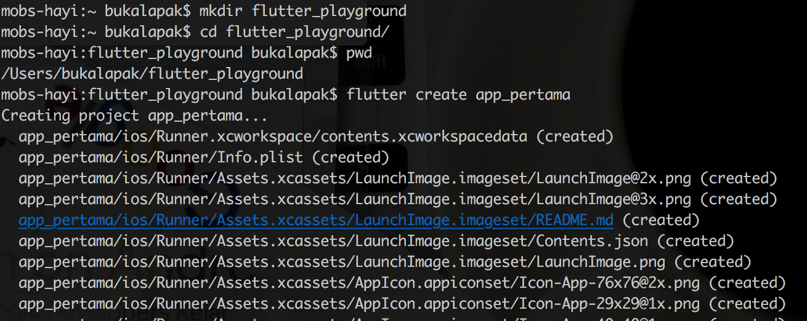
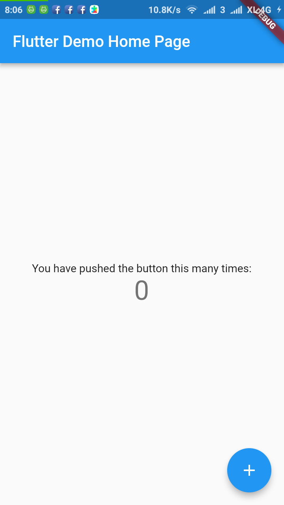

# Aplikasi Pertama


## Membuat Project

Untuk membuat project flutter siapkan direktory kosong terlebih dahulu.

```bash
cd ~
mkdir flutter_playground
cd flutter_playground
```

Kemudian buat project baru dengan nama `app_pertama` dengan menggunakan perintah:

```bash
flutter create app_pertama
```

Nama project harus menggunakan huruf kecil dan tidak boleh terpisah spasi.



  
Tunggu hingga proses pembuatan project selesai, dan jika di list pada direktori tersebut, maka akan ada tambahan satu direktori yakni direktori `app_pertama`.


  
Masuk ke direktory project, kemudian test jalankan dengan menggunakan perintah `flutter run`. Tapi sebelumnya pastikan Emulator sudah dijalankan atau HP yang sudah di enable developer modenya terhubung dengan komputer anda.

```bash
cd app_pertama
flutter run
```



## Mengimport Project ke Visual Code Studio

Buka Visual code studio, kemudian pilih menu **File &gt; Add Folder to Workspace**


Cari dimana lokasi project dibuat, kemudian click folder project, kemudian import.


## Menjalankan Project via Visual Code Studio

Cara paling mudah adalah dengan menggunakan plugin terminal untuk VCS. Install plugin kemudian jalankan perintah `flutter run` melalu terminal.


